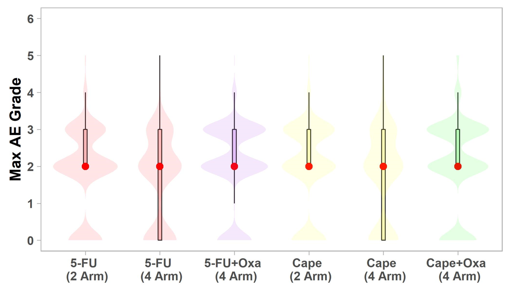
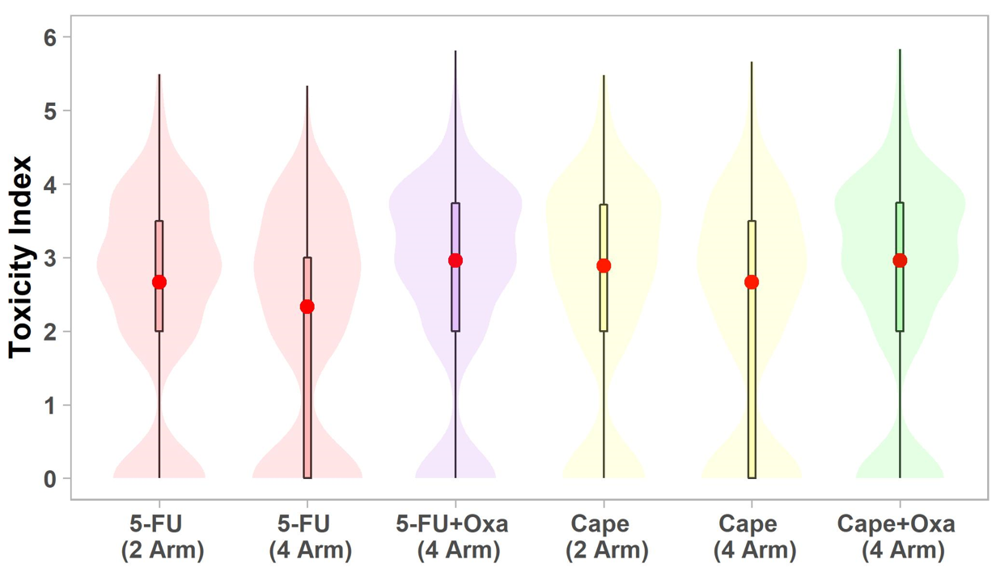

```{r setup, include=FALSE}

library(tidyverse)
library(datasauRus)
library(patchwork)
library(gt)
library(datasauRus)

options(htmltools.dir.version = FALSE)

knitr::opts_chunk$set(
  fig.width=9, fig.height=3.5, 
  fig.retina=3,
  out.width = "100%",
  cache = FALSE,
  echo = F,
  message = FALSE, 
  warning = FALSE,
  fig.show = TRUE,
  hiline = TRUE,
  comment = ''
)


theme_set(
  theme_minimal(base_size = 15) + 
    theme(strip.text.x = element_text(face = 'bold', size = 15),
          panel.grid.minor = element_blank())
)

```

```{r xaringan-themer, include=FALSE, warning=FALSE}
library(xaringanthemer)

style_duo_accent(
  primary_color = "#1381B0",
  secondary_color = "#FF961C",
  inverse_header_color = "#FFFFFF"
)
```


class: center middle

# Graphical Descriptive Statistics

Michael Luu, MPH | Marie Lauzon, MS

Biostatistics & Bioinformatics Research Center | Cedars Sinai Medical Center

#### `r Sys.Date() %>% format(., '%B %d, %Y')`

???

* Hi Everyone - My name is Michael Luu, and I'm a Research Biostatistician here at the Biostatistics Core as part of Cedar Sinai Cancer Center. Today I will be talking about graphical descriptive statistics. The objective of my talk is to provide a motivating example on the need to visualize our data, as well as provide some of the basic tools and types of simple figures you can use to accomplish this goal. 

* So to start off my talk, I want to provide a motivating example -

---
class: inverse center middle

# Why do we need to visualize our data?

---

```{r, include = F}
data <- datasauRus::datasaurus_dozen

plot_data <- data %>%
  filter(dataset %in% c('dino', 'star', 'x_shape', 'circle'))  %>%
  mutate(dataset = factor(
    dataset,
    levels = c('dino', 'star', 'x_shape', 'circle'),
    labels = LETTERS[1:4]
  ))


```

.pull-left[
```{r}

plot_data %>%
  mutate(across(where(is.numeric), ~ scales::number(.x, .01))) %>%
  filter(dataset == 'A') %>%
  head(n = 5) %>%
  knitr::kable()

```

<br>

```{r}
plot_data %>%
  mutate(across(where(is.numeric), ~ scales::number(.x, .01))) %>%
  filter(dataset == 'B') %>%
  head(n = 5) %>%
  knitr::kable()

```

]

.pull-right[
```{r}

plot_data %>%
  mutate(across(where(is.numeric), ~ scales::number(.x, .01))) %>%
  filter(dataset == 'C') %>%
  head(n = 5) %>%
  knitr::kable()

```

<br>

```{r}

plot_data %>%
  mutate(across(where(is.numeric), ~ scales::number(.x, .01))) %>%
  filter(dataset == 'D') %>%
  head(n = 5) %>%
  knitr::kable()

```

]

???

* What I'm showing here are 4 unique datasets - dataset A, B, C, and D.

* Of note, these are truncated versions of the full dataset, where i'm only showing the first 5 rows due to space.

* Each dataset has 3 variables, the dataset variable, X, and Y

* X, and Y are both continuous variables as seen on this slide


---
class: inverse center middle 

# Let's begin by taking descriptive measures


???

* So, let's begin by taking some descriptive summary measures of the four datasets as discussed by my colleauge Marie

---

# Quantitative Summaries

.center[
```{r}

plot_data %>%
  group_by(dataset) %>%
  summarise(
    n = n(),
    mean_x = mean(x),
    sd_x = sd(x),
    mean_y = mean(y),
    sd_y = sd(y)
  ) %>%
  mutate(across(where(is.numeric), ~ scales::number(.x, .1))) %>%
  knitr::kable()

```
]

???

* What you're seeing here is a small table with some basic summary measures like counts (n), mean, and standard deviation. We have summary measures for each of the four datasets as seen on each rows.

* For example, the first row is showing the descriptive measures for dataset A, followed by B, C, and D.

* For dataset A, we have 142 rows, with a mean of 54.3 for X, 47.8 for Y, with the SD of X as 16.8 and the SD of Y as 26.9

* You may have already noticed the obvious...

* The summary measures are identical for all four datasets!

--

* It appears the counts (n), mean (x), mean (y), and sd (x) and sd (y) are identical for ALL four datasets!

---
class: inverse center middle

# Can we conclude the datasets are similiar or identical?

???

* So what can we conclude about the four datasets ?

---

class: center middle

# Not quite yet!

---

class: inverse center middle

# Let's visualize the relationship of x and y

---

```{r}
vis_datasaurus <- \(plot_data, dataset) {
  
  ggplot(plot_data %>% filter(dataset == !!dataset), aes(x = x, y = y)) +
    geom_point() +
    coord_equal(xlim = c(0, 100), ylim = c(0, 100)) +
    theme_bw()
  
}

```

# Dataset A

.center[

```{r}
vis_datasaurus(plot_data, 'A')
```

]

???

* What you are seeing is a scatter plot of X and Y for dataset A. In short, a scatter plot allows us to visualize the relationship between two continuous variables. We have X on the x-axis, and Y on the y-axis. Each point represents a single observation with the corresponding X and Y values. When visualized we have this plot of a dino.

---

# Dataset B

.center[

```{r}
vis_datasaurus(plot_data, 'B')
```

]

???

* Again, when visualizing dataset B, we have a plot of a star

---

# Dataset C

.center[

```{r}
vis_datasaurus(plot_data, 'C')
```

]

???

* For dataset C, we have an X
---

# Dataset D

.center[

```{r}
vis_datasaurus(plot_data, 'D')
```

]

???

* And for dataset D, we have a circle
---
class: center middle

```{r, out.width = '75%'}
knitr::include_graphics('images/blow-mind-mind-blown.gif')
```

???

* You might be thinking, what is going on!? I just showed you four different datasets with identical or near identical summary measures, yet we have these unique and interesting figures...

---
class: center middle

```{r}
knitr::include_graphics('images/DinoSequentialSmaller.gif')
```

???

* This phenomenom expands to more than just the 4 example datasets that I showed, but we have 13 datasets as seen on this slide that have near identical summary measures when visualized.

* So what is the take away from this rather unique and exaggerated example ? 

---

class: inverse center middle

# Although simple quantitative summaries are similar ...

---

class: center middle

# They can appear drastically different when visualized!

---

# Datasaurus Dozen

* The original "Datasaurus" or "dino" was created by **Alberto Cairo** in the following [blog post](http://www.thefunctionalart.com/2016/08/download-datasaurus-never-trust-summary.html)

* He was then later made famous by the paper published by **Justin Matejka** and **George Fitzmaurize**, titled ['Same Stats, Different Graphs: Generating Datasets with Varied Appearance and Identical Statistics through Simulated Annealing'](https://www.autodesk.com/research/publications/same-stats-different-graphs), where they simulated 12 additional datasets in addition to the original "Datasaurus" with nearly identical simple statistics

???

* Now a little background on the dataset that I showed - The dataset is called the datasaurus dozen

---

class: middle

.center[

```{r, out.width='75%', fig.height=8, fig.width=12}
data <- datasauRus::datasaurus_dozen

ggplot(data, aes(x = x, y = y)) + 
  geom_point() +
  facet_wrap(~dataset, ncol = 5) + 
  theme_minimal()

```

]

???

* The following is the original 'dino' or datasaurus along with the 12 additional datasets that were carefully simulated to have near identical summary measures

* The method they used to create these datasets is out of the scope of this talk, however the important take away is the emphasis on the need to visualize your data.

* As seen on this slide, simple summary measures are useful, however they CAN be deceiving when you're not careful. Plots and figures are able to describe your data in a completely new dimension that is not being captured by simple summary measures.

---

# Anscombe Quartet

* The datasaurus dozen is a modern take on the classical **"Anscombe's Quartet"**
  - Anscombe, F. J. (1973). "Graphs in Statistical Analysis". American Statistician. 27 (1): 17–21. doi:10.1080/00031305.1973.10478966. JSTOR 2682899
  
  - Comprised of four datasets that have nearly identical simple summary measures, yet have very different distributions and appear vastly different when plotted

---

class:

# Anscombe Quartet

.center[

```{r}

local({
  
    data <- tibble::tribble(
    ~dataset,  ~x,    ~y,
         "I", 10L,  8.04,
         "I",  8L,  6.95,
         "I", 13L,  7.58,
         "I",  9L,  8.81,
         "I", 11L,  8.33,
         "I", 14L,  9.96,
         "I",  6L,  7.24,
         "I",  4L,  4.26,
         "I", 12L, 10.84,
         "I",  7L,  4.82,
         "I",  5L,  5.68,
        "II", 10L,  9.14,
        "II",  8L,  8.14,
        "II", 13L,  8.74,
        "II",  9L,  8.77,
        "II", 11L,  9.26,
        "II", 14L,   8.1,
        "II",  6L,  6.13,
        "II",  4L,   3.1,
        "II", 12L,  9.13,
        "II",  7L,  7.26,
        "II",  5L,  4.74,
       "III", 10L,  7.46,
       "III",  8L,  6.77,
       "III", 13L, 12.74,
       "III",  9L,  7.11,
       "III", 11L,  7.81,
       "III", 14L,  8.84,
       "III",  6L,  6.08,
       "III",  4L,  5.39,
       "III", 12L,  8.15,
       "III",  7L,  6.42,
       "III",  5L,  5.73,
        "IV",  8L,  6.58,
        "IV",  8L,  5.76,
        "IV",  8L,  7.71,
        "IV",  8L,  8.84,
        "IV",  8L,  8.47,
        "IV",  8L,  7.04,
        "IV",  8L,  5.25,
        "IV", 19L,  12.5,
        "IV",  8L,  5.56,
        "IV",  8L,  7.91,
        "IV",  8L,  6.89
    )
    
    data %>%
      group_by(dataset) %>%
      summarise(
        n = n(),
        mean_x = mean(x),
        sd_x = sd(x),
        meay_y = mean(y),
        sd_y = sd(y)
      ) %>%
      mutate(across(where(is.numeric), ~ scales::number(.x, .01))) %>%
      knitr::kable()
})
```

]

.center[
```{r, out.width='100%', fig.height=3, fig.width=12}
local({
  data <- tibble::tribble(
    ~dataset,  ~x,    ~y,
         "I", 10L,  8.04,
         "I",  8L,  6.95,
         "I", 13L,  7.58,
         "I",  9L,  8.81,
         "I", 11L,  8.33,
         "I", 14L,  9.96,
         "I",  6L,  7.24,
         "I",  4L,  4.26,
         "I", 12L, 10.84,
         "I",  7L,  4.82,
         "I",  5L,  5.68,
        "II", 10L,  9.14,
        "II",  8L,  8.14,
        "II", 13L,  8.74,
        "II",  9L,  8.77,
        "II", 11L,  9.26,
        "II", 14L,   8.1,
        "II",  6L,  6.13,
        "II",  4L,   3.1,
        "II", 12L,  9.13,
        "II",  7L,  7.26,
        "II",  5L,  4.74,
       "III", 10L,  7.46,
       "III",  8L,  6.77,
       "III", 13L, 12.74,
       "III",  9L,  7.11,
       "III", 11L,  7.81,
       "III", 14L,  8.84,
       "III",  6L,  6.08,
       "III",  4L,  5.39,
       "III", 12L,  8.15,
       "III",  7L,  6.42,
       "III",  5L,  5.73,
        "IV",  8L,  6.58,
        "IV",  8L,  5.76,
        "IV",  8L,  7.71,
        "IV",  8L,  8.84,
        "IV",  8L,  8.47,
        "IV",  8L,  7.04,
        "IV",  8L,  5.25,
        "IV", 19L,  12.5,
        "IV",  8L,  5.56,
        "IV",  8L,  7.91,
        "IV",  8L,  6.89
    )
  
  ggplot(data, aes(x = x, y = y)) + 
    geom_point() + 
    facet_wrap(~dataset, ncol = 4) + 
    theme_minimal(base_size = 15)

  
})
```


???

* Describe how if we use a regression and how it can be affected

]

---
class: inverse middle center

# Types of Graphical Visualizations

???

* Now I would like to go into some detail on different ways to graphically summarize your data

---

# Dot plot 

.pull-left[

* Useful for small to moderate sized data

* Allows us to visualize the spread and distribution of one continuous discrete variables
  * e.g. length of stay

* The X axis is the variable of interest and each dot represents a single observation

* Easy to identify the mode

* Highlights clusters, gaps, and outliers

* Intuitive and easy to understand

]

.pull-right[

```{r, fig.height=4, fig.width=6}

local({
  set.seed(5)
  data <- tibble(x = rnorm(50, 25, sd = 5) %>% round())
  
  ggplot(data, aes(x = x)) +
    geom_dotplot(
      method = 'histodot',
      binwidth = 1,
      dotsize = 1,
      stackratio = 1.1
    ) +
    theme_minimal(base_size = 15) +
    theme(panel.grid.minor = element_blank()) +
    scale_x_continuous(breaks = seq(0, 50, 1)) +
    scale_y_continuous(breaks = NULL) +
    labs(y = NULL)
  
})

```

]

???

* One of the most basic visualizations that allows you to get a sense of the data is the dot plot.

<!-- * If we take another sample - the figure may look difference -->

---

# Histogram

.pull-left[

* Useful for all sized data (small and large)

* Allows us to visualize the spread and distribution of continuous variables

* Each bar represents a 'bin' or a defined interval of values

* Although not as common, the width of the bins does NOT have to be equal!

* The y axis or the height of the bar represents the count of the number of values that fall into each bin
  
* The y axis is also commonly normalized to 'relative' frequencies to show the proportion of cases or density that falls into each bin.
]

.pull-right[

```{r, fig.height=5, fig.width=6}

local({
  set.seed(1)
  data <- tibble(x = rnorm(1000, 25, sd = 2))
  
  plot_a <- ggplot(data, aes(x = x)) +
    geom_histogram(color = 'white', binwidth = 1) + 
    labs(y = 'Frequency') + 
    geom_density(aes(y = 1 * ..count..))
  
  plot_b <- ggplot(data, aes(x = x)) +
    geom_histogram(color = 'white', breaks = c(seq(18, 25, 1), 28, 30)) + 
    labs(y = 'Frequency') + 
    scale_x_continuous(breaks = seq(0, 40, 1)) 
  
  plot_a / plot_b
  
})

```

]

???


---

# Distribution

> "A distribution is simply a collection of data, or scores, on a variable. Usually, these scores are arranged in order from smallest to largest and then they can be presented graphically."

— Page 6, Statistics in Plain English, Third Edition, 2010.

```{r, fig.align='center', fig.width=6, fig.height=4, out.width='50%'}
local({
  set.seed(1)
  data <- tibble(x = rnorm(1000, 25, sd = 2))

  ggplot(data, aes(x = x)) +
    geom_histogram(color = 'white', binwidth = 1) +
    labs(y = 'Frequency') +
    geom_vline(aes(xintercept = mean(x)), color = 'red', size = 1) +
    geom_vline(aes(xintercept = median(x)), color = 'green', size = 1, linetype = 'dashed') + 
    geom_vline(aes(xintercept = 25), color = 'blue', size = 1, linetype = 'dotted') +
    geom_density(aes(y = 1 * ..count..))
})


```

???

* In statistics we also have something called a probability distributions, in which we understand the probability of occurrences of a random values - assuming they follow a specific distribution.

* The values as seen in the histogram below is from the most well understood normal probability distribution, or 'normal distribution' that resembles a bell shaped curve

* Histograms allows us to better understand the distribution or shape of our data.

* One of the highlighted properties of the normal distribution includes the peak of the bell shaped curve to indicate the location of the mean, median, and mode.


---

# Normal Distribution

```{r, out.width='65%', fig.align='center'}
knitr::include_graphics('images/normal_distribution_figure.png')
```

???

* As mentioned previously, if we understand the distribution or shape of our data and assume it follows a specific distribution like the normal distribution. We understand the frequency or probability of occurrences of such random values.

* For example, 68.2% of the values occur within plus and minus 1 standard deviation away from the mean. 95.4% of the values occur within two standard deviation away from the mean and 99.7% of the values falls within 3 standard deviations away from the mean.


<!-- * Add the numbers e.g. 68.27 on the plot  -->

---

# Univariate Continuous Distributions

```{r, fig.align='center', out.width='50%'}
knitr::include_graphics('images/univariate_continuous_distributrions.PNG')
```

???

* The normal distribution is just one of many probability distributions as visualized in the following figures

* Shown on this slide are just a small snapshot of the distributions that have been studied

* Some of the notable distributions on this slide include the 'Normal distribution' which we just discussed, as well as the Student T distribution.

---

# Univariate Discrete Distributions

```{r, fig.align='center', out.width='50%'}
knitr::include_graphics('images/univariate_discrete_distributions.PNG')
```

???

* Again, Among the univariate discrete distributions, some of the notable ones include the Binomial and the Poisson distributions.

---

# Scatter plot

.pull-left[

* Used to visualize the relationship between two continuous variables

* Useful for detecting patterns that are obscured from quantitative summaries like what we observed in Anscombe's quartet and the Datasaurus dozen.


]

.pull-right[

```{r, fig.height=4, fig.width=6}

set.seed(1)
data <- tibble(
  x = rnorm(25, 25, sd = 5),
  y = rnorm(25, 45, sd = 2)
)

ggplot(data, aes(x = x, y = y)) + 
  geom_point() +
  theme_minimal(base_size = 15)

```

]

???

* Next I wanted to reintroduce the scatter plot - 

---

# Bar plot

.pull-left[

* Useful for visualizing **categorical** data

* Commonly used to present counts and proportion of each level

* Allows us to quickly observe the difference in magnitude of each level based on the height of each bar

]

.pull-right[

```{r, fig.height=6, fig.width=6, out.width='100%', fig.align='center'}

local({
  set.seed(1)
  data <- tibble(x = rnorm(25, 25, sd = 5) %>% round(),
                 group = sample(c('A', 'B'), size = 25, replace = T))
  
  plot_data <- data %>%
    group_by(group) %>%
    count() %>%
    ungroup() %>%
    mutate(prop = n / sum(n)) %>%
    mutate(label = glue::glue('{n} ({scales::percent(prop, .1)})'))
  
  plota <- ggplot(plot_data, aes(x = group, y = n, fill = group)) +
    geom_col() +
    theme_minimal(base_size = 15) +
    theme(panel.grid.minor = element_blank(),
          legend.position = 'none',
          axis.text.x = element_text(face = 'bold')) +
    geom_text(
      aes(label = label, y = n / 2),
      hjust = .5,
      size = 5,
      color = 'white',
      fontface = 'bold'
    ) +
    ggsci::scale_fill_d3() + 
    labs(x = NULL, y = 'Frequency')
  
  plotb <- ggplot(plot_data, aes(x = group, y = prop, fill = group)) +
    geom_col() +
    theme_minimal(base_size = 15) +
    theme(
      panel.grid.minor = element_blank(),
      legend.position = 'none',
      axis.text.x = element_text(face = 'bold')
    ) +
    geom_text(
      aes(label = label, y = prop / 2),
      hjust = .5,
      size = 5,
      color = 'white',
      fontface = 'bold'
    ) +
    ggsci::scale_fill_d3() +
    labs(x = NULL, y = 'Proportion (%)') + 
    coord_cartesian(ylim = c(0, 1)) + 
    scale_y_continuous(labels = scales::percent)
  
  plota / plotb
  
})

```

]

---

class: inverse middle center

# However...

---

class: middle center

# Bar plots are commonly misued!

---

# How NOT to Bar Plot

```{r, out.width='50%', fig.align='center'}
knitr::include_graphics('images/how_not_to_barplot.PNG')

## 14 mins here

```

* Krzywinski, M., & Altman, N. (2014). Visualizing samples with box plots. Nature methods, 11(2), 119-120.

???

* The following three figures are examples of how NOT to use a bar plots

* Showing sample mean and SD or stand error are NOT recommended!

* Depending on what you define as the baseline, they can drastically alter the appearance of the height of the bars as seen in the first and second figure. The first figure on the left is using 0 as a reference, where the middle figure is using 0.5 as the reference.

* Creating breaks in the Y axis as seen on the third figure will also distort our data.

---

# How NOT to Bar Plot

.pull-left[

* Although frequently found and prevalent in the literature, this is NOT to be used to describe mean and dispersion (continuous data)

* Only shows one arm of the error bar, making overlap comparisons difficult

* Promotes misconception of the mean being related to its height rather the position of the top of the bar

* Obscures the distribution and spread of the data

]

.pull-right[

```{r, fig.height=4, fig.width=6}

local({

  set.seed(1)
  a <- tibble(group = 'A',
              x = rnorm(n = 100, mean = 50, sd = 10))
  
  set.seed(2)
  b <- tibble(group = 'B',
              x = rnorm(n = 100, mean = 50, sd = 2))
  
  data <- bind_rows(a, b)
  
  
  plot_data <- data %>%
    group_by(group) %>%
    summarise(
      mean = mean(x),
      sd = sd(x)
    )
  
  ggplot(plot_data, aes(x = group, y = mean, fill = group)) +
    geom_errorbar(aes(ymin = mean - sd, ymax = mean + sd), width = .1, size = 1) +
    geom_col() +
    theme_minimal(base_size = 15) +
    theme(panel.grid.minor = element_blank(),
          legend.position = 'none',
          axis.text.x = element_text(face = 'bold')) +
    ggsci::scale_fill_d3() + 
    labs(x = NULL) 
  
})

```


]

---

# Box plot

.pull-left[

* Useful for describing continuous variables following a uni-modal distribution
  - e.g. a single peak

* The box is representative of common quantitative measures
  - Top of box is the 75th quantile
  - Middle dash inside box is the 50th quantile
  - Bottom of box is the 25th quantile
  - Width of the box is the interquartile range (IQR)

* The 'whiskers' are artificial 'fences' that helps identify potential outliers in the data
  - Defined as Q1 - 1.5\*IQR and Q3 + 1.5\*IQR

]

.pull-right[

```{r, fig.height=4, fig.width=6, out.width='80%', fig.align='center'}

set.seed(1)
data <- tibble(
  group = sample(c('A', 'B'), 50, replace = T),
  y = c(rnorm(25, 30, sd = 20), rnorm(25, 45, sd = 2))
)

ggplot(data, aes(x = group, y = y, color = group)) +
  stat_boxplot(geom = 'errorbar', width = .1) +
  geom_boxplot(width = .25) +
  theme_minimal(base_size = 15) +
  theme(legend.position = 'none',
        axis.text.x = element_text(face = 'bold')) + 
  ggsci::scale_color_d3() + 
  labs(x = NULL)


```

```{r, fig.align='center', out.width='80%'}

knitr::include_graphics('images/boxplot_explained.png')
```

]

---
class: inverse center middle 

# What are some of the problems with a box plot?

---
class: center middle 

# They are based on quantitative summaries!

---

# Box plot

```{r}
knitr::include_graphics('images/BoxViolinSmaller.gif')
```

???

* As we learned from the beginning of the talk, quantitative summaries can be deceiving

* The left figure is the 'Raw Data', the middle figure are box plots, and the right figure are something called 'violin plots'

* These plots are called 'violin plots' because, as you guessed, they resemble violins.

* As you can see on the left figure, as the raw data gets distorted, we still have identical box plots in the middle, since the properties of a box plot are based on quantitative summaries. It's possible to have identical quantitative summaries, that appear drastically different which the box plot was not able to capture.

* Violin plots are able to capture the change in the data that was just not possible using a simple box plot.

---

# Violin plot

.pull-left[

* Violin plots are box plots, with an overlay of the density distribution (histogram) of the data

* More informative than a simple box plot

* Visualizes the full distribution of the data

* Especially useful for bimodal or multimodal distribution
  * e.g. distribution of data with multiple peaks

]

.pull-right[

```{r, fig.height=4, fig.width=6}

set.seed(1)
data <- tibble(
  group = sample(c('A', 'B'), 50, replace = T),
  y = c(rnorm(25, 30, sd = 2), rnorm(25, 45, sd = 2))
)

ggplot(data, aes(x = group, y = y)) +
  geom_boxplot(width = .1, aes(color = group)) +
  geom_violin(aes(fill = group, color = NA), alpha = .2) +
  theme_minimal(base_size = 15) +
  theme(legend.position = 'none',
        axis.text.x = element_text(face = 'bold')) + 
  ggsci::scale_color_d3() + 
  ggsci::scale_fill_d3() +
  labs(x = NULL) + 
  coord_cartesian(expand = T)
```

]

---

# How are violin plots made?

```{r, out.width='100%', fig.align='center'}

knitr::include_graphics('images/how_to_make_violin_plots.PNG')

```

* Hintze, J. L., & Nelson, R. D. (1998). Violin plots: a box plot-density trace synergism. The American Statistician, 52(2), 181-184.

???

* Violin plots are an amalgamation of a box plot and a histogram

---

```{r, out.width='100%', fig.align='center'}

```

???

* I wanted to briefly touch upon the usage of violin plots in the literature and highlight some of our ongoing research that's led by the director of the biostatistic core - Dr. Andre Rogatko

* We are using data from the NSABP R-04 trial - Neoadjuvant chemotherapy in rectal cancer

* In this trial - Rectal cancer is treated with presurgical radiation to downstage the tumor, reduce the risk of local recurrence and improve survival

* R04 first tested infusional 5FU (standard) vs. capecitabine (an oral drug), and then 2x2 factorial design, with or without oxaliplatin

* The results of the analysis of the NSABP R-04 trial using the toxicity index is detailed in the following article

* In short, we reanalyzed the clinical trial data using the toxicity index as developed by Rogatko et al. and compared it to using the current standard of assessing toxicity using the maximum reported grade.

* I also wanted to note that several of the coauthors on this list are also lecturers of this series

* Rogatko, A., Babb, J. S., Wang, H., Slifker, M. J., & Hudes, G. R. (2004). Patient characteristics compete with dose as predictors of acute treatment toxicity in early phase clinical trials. Clinical Cancer Research, 10(14), 4645-4651.

---
class:

<br>
<br>
<br>
<br>

.pull-left[
```{r,out.width='100%', fig.align='center'}

```
]

.pull-right[
```{r,out.width='100%', fig.align='center'}

```
]


???

* I wanted to highlight the usage of violin plots that were utilized here in describing the distribution of Max grade and the TI

* Violin plots were able to highlight the multimodal distribution of both the Max grade and the TI that would not have been visible with just a simple box plot.

* Results of the study found the toxicity index was more powerful than the max ae grade, and requiring smaller sample sizes to detect the same differences.


---

# Summary

.pull-left[
* One continuous variable 
  - Dot plot 
  - Histogram
  - Box plot 
  - Violin plot

* One categorical variable 
  - Bar plot 

* Two continuous variable 
  - Scatter plot 

* One continuous by categorical variable 
  - Dot plot 
  - Box plot 
  - Violin plot

]

.pull-right[

```{r, out.width = '100%'}
knitr::include_graphics('images/scientific_paper_graph_quality.png')
```

]


???

* To end I wanted to leave everyone with a general guide on how to visualize your data, this is by far not a comprehensive list

---
class: center middle

# Descriptive summaries are useful, however ...

---

class: inverse center middle 

# Don't forget to visualize your data!

---

class: center middle

# Questions
