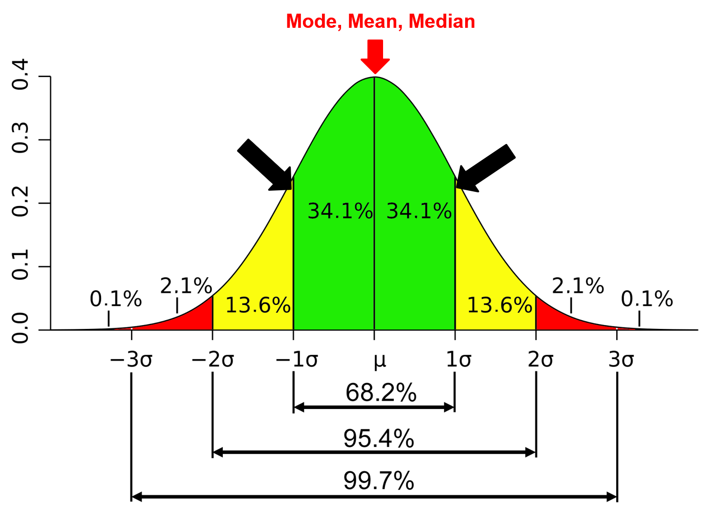
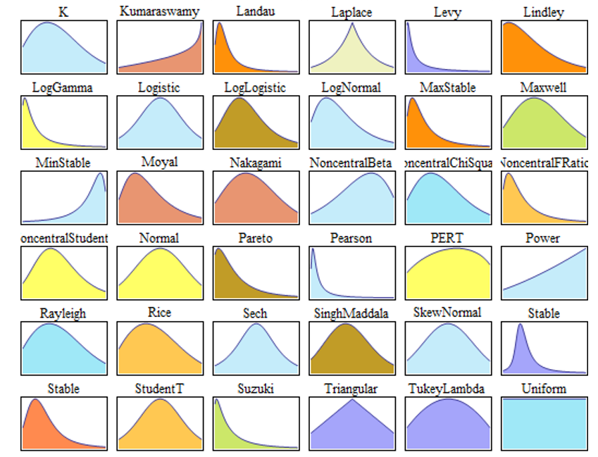
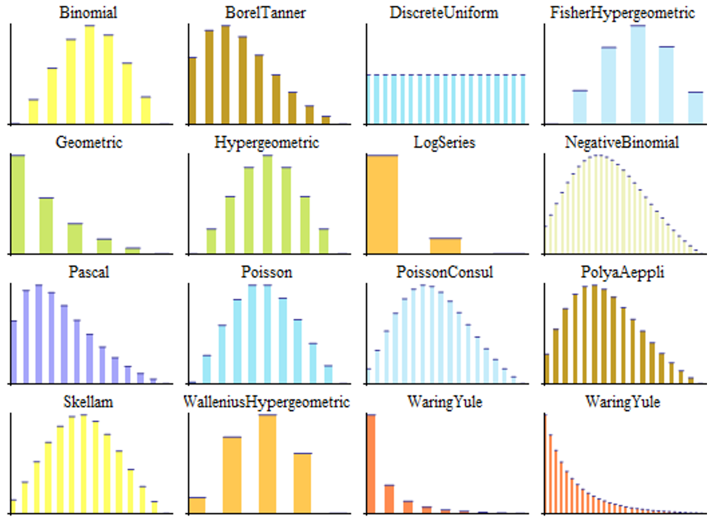
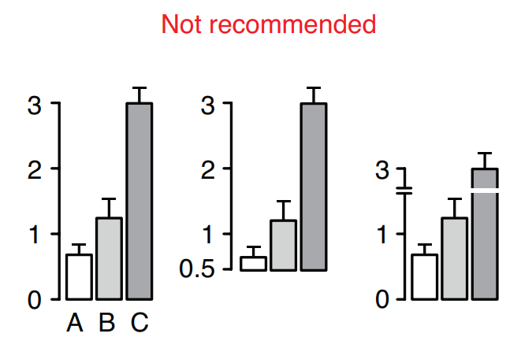
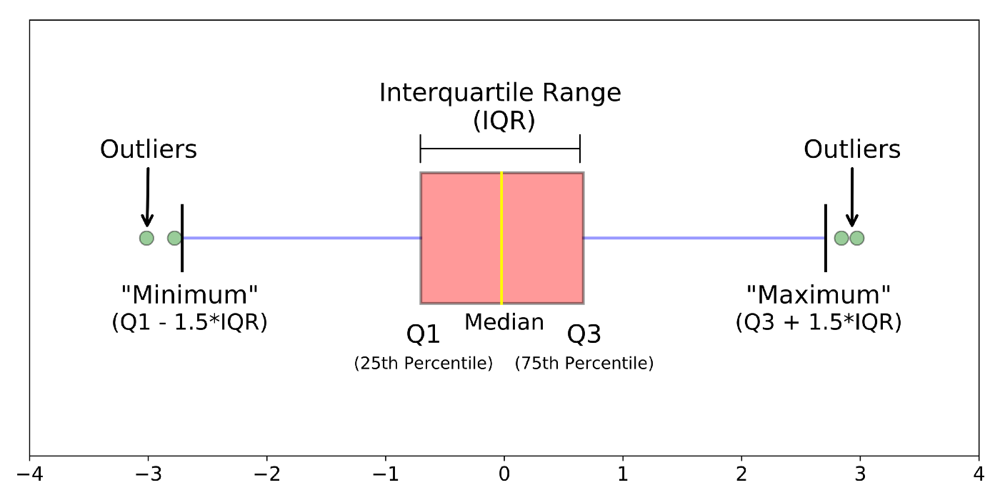
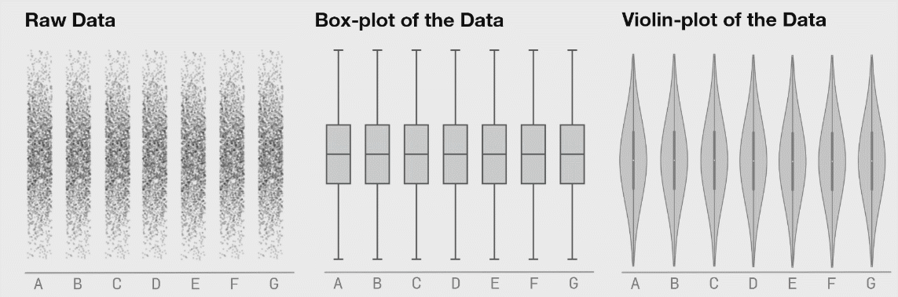

---
format:
  revealjs:
    theme: [default, custom.scss]
    slide-number: true
    transition: fade
    footer: Biostatistics Shared Resource | Cedars-Sinai
    menu: false
    overview: true
    chalkboard: false
    lightbox: true
fig-dpi: 300
knitr:
  opts_chunk:
    dev: "ragg_png"
editor_options:
  chunk_output_type: console
cache: true
---

# Descriptive Statistics
[The Importance of Visualization]{.teal style='font-size:1.2em;'}

```{r}
library(tidyverse)
library(datasauRus)
library(patchwork)
library(gt)
library(datasauRus)
library(gtExtras)
```

::: {style="text-align: left; font-size: .7em"}
| Michael Luu, MPH | Marie Lauzon, MS
| Biostatistics Shared Resource | Cedars-Sinai Medical Center
| September 1, 2026
:::

::: notes
-   Hi Everyone - My name is Michael Luu, and I'm a Research Biostatistician here at the Biostatistics Shared Resources as part of Cedars-Sinai Cancer Center. Today I will be talking about descriptive statistics, and the importance of data visualization. The objective of my talk is to provide a motivating example on the need to visualize our data, as well as provide some of the basic tools and types of simple figures you can use to accomplish this goal.

:::

# {.smaller}

Slides can be accessed with the following link:

https://mluu921.github.io/cshs-fall-lecture-descriptive-statistics

Also available as a PDF on Onedrive

## Why describe data? {.smaller}

::: incremental
-   [Summarize]{.bold-highlight} - reduce many observations into a few numbers or pictures a person can actually hold in their head

-   [Detect anomalies]{.bold-highlight} - outliers, data entry errors, and missingness patterns

-   [Check assumptions]{.bold-highlight} - most inferential methods (e.g. t-tests, linear regression) assume something about the shape of the data

-   [Communicate]{.bold-highlight} - Table 1 of nearly every clinical paper is descriptive statistics
:::

::: notes

-   Before we get into the how, a quick reminder of the why. There are really four reasons we describe data.

-   The first is to summarize. A dataset with thousands of rows is not something a human can meaningfully hold in their head - we need to reduce it down to a handful of numbers or a picture.

-   The second is to detect anomalies. Simple summaries and figures are often the fastest way to catch outliers, data entry errors, or unexpected missingness before they cause problems downstream.

-   The third is to check assumptions. Almost every inferential method - t-tests, linear regression, ANOVA - assumes something about the shape or distribution of the data. Describing your data is how you verify those assumptions hold.

-   And the fourth is simply to communicate. Table 1 of nearly every clinical paper is a descriptive summary of the study cohort.

-   Marie just covered the quantitative side of describing data. I'll be covering the visual side. Both serve these same four goals - and as we'll see next, they work best together.

:::


# Why do we need to visualize our data?

## Data

```{r}
data <- datasauRus::datasaurus_dozen

plot_data <- data |>
  filter(dataset %in% c('dino', 'star', 'x_shape', 'circle')) |>
  mutate(
    dataset = factor(
      dataset,
      levels = c('dino', 'star', 'x_shape', 'circle'),
      labels = LETTERS[1:4]
    )
  )
```

```{r}

plot_data |>
  gt() |>
  opt_interactive(
    use_compact_mode = TRUE,
    use_filters = TRUE
  )
```

::: notes
-   What I'm showing here are 4 unique datasets - dataset A, B, C, and D.

-   Of note, these are truncated versions of the full dataset, where i'm only showing the first 5 rows due to space.

-   Each dataset has 2 variables, X, and Y

-   X, and Y are both continuous variables as seen on this slide
:::

# Let's begin by taking descriptive measures

::: notes
-   So, let's begin by taking some descriptive summary measures of the four datasets as discussed by my colleague Marie
:::

##  {.center}

```{r}
plot_data |>
  group_nest(dataset) |>
  mutate(
    n = map_int(data, ~ nrow(.x)),
    mean_x = map_dbl(data, ~ mean(.x$x)),
    sd_x = map_dbl(data, ~ sd(.x$x)),
    mean_y = map_dbl(data, ~ mean(.x$y)),
    sd_y = map_dbl(data, ~ sd(.x$y))
  ) |>
  mutate(across(
    c(mean_x, sd_x, mean_y, sd_y),
    ~ scales::label_number(.1)(.x)
  )) |>
  select(-data) |>
  gt() |>
  tab_options(table.font.size = px(40))
```

<br>

::: {.fragment}
It appears the counts (n), mean (x), mean (y), and sd (x) and sd (y) are identical for ALL four datasets!
:::

::: notes
-   What you're seeing here is a small table with some basic summary measures like counts (n), mean, and standard deviation. We have summary measures for each of the four datasets as seen on each rows.

-   For example, the first row is showing the descriptive measures for dataset A, followed by B, C, and D.

-   For dataset A, we have 142 rows, with a mean of 54.3 for X, 47.8 for Y, with the SD of X as 16.8 and the SD of Y as 26.9

-   You may have already noticed the obvious...

-   The summary measures are identical for all four datasets!
:::

# Can we conclude the datasets are similar or identical?

::: notes
-   So what can we conclude about the four datasets ?
:::

# Not quite yet!

# Let's visualize the relationship of x and y

## 

```{r}
#| fig-align: center
#| out-width: 50%
#| fig-height: 12
#| fig-width: 12

plot_data <- plot_data %>%
  group_nest(dataset) %>%
  deframe()

plots <- imap(
  plot_data,
  ~ {
    plot <- ggplot(.x, aes(x = x, y = y)) +
      geom_point(size = 2) +
      coord_equal(xlim = c(0, 100), ylim = c(0, 100)) +
      theme_bw(base_size = 20) +
      labs(title = glue::glue('Dataset: {.y}'))

    plot
  }
)

wrap_plots(plots)
```

::: notes
-   What you are seeing is a scatter plot of X and Y for dataset A. In short, a scatter plot allows us to visualize the relationship between two continuous variables. We have X on the x-axis, and Y on the y-axis. Each point represents a single observation with the corresponding X and Y values. When visualized we have this plot of a dino.
:::

## 

```{r}
#| fig-align: center
#| out-width: 100%
knitr::include_graphics('images/DinoSequentialSmaller.gif')
```

::: aside
* https://www.autodesk.com/research/publications/same-stats-different-graphs
:::

::: notes

-   You might be thinking, what is going on!? I just showed you four different datasets with identical or near identical summary measures, yet we have these unique and interesting figures...

-   This phenomenon expands to more than just the 4 example datasets that I showed, but we have 13 datasets as seen on this slide that have near identical summary measures when visualized.

-   So what is the take away from this rather unique and exaggerated example
:::

# Although simple quantitative summaries are similar ...

# They can appear drastically different when visualized!

## Datasaurus Dozen {.smaller}

::: incremental
-   The original "Datasaurus" or "dino" was created by [Alberto Cairo]{.bold-highlight} in the following [blog post](http://www.thefunctionalart.com/2016/08/download-datasaurus-never-trust-summary.html)^[<http://www.thefunctionalart.com/2016/08/download-datasaurus-never-trust-summary.html>]

-   He was then later popularized by the paper published by [Justin Matejka]{.bold-highlight} and [George Fitzmaurice]{.bold-highlight}, titled ['Same Stats, Different Graphs: Generating Datasets with Varied Appearance and Identical Statistics through Simulated Annealing'](https://www.autodesk.com/research/publications/same-stats-different-graphs)^[<https://www.autodesk.com/research/publications/same-stats-different-graphs>], where they simulated 12 additional datasets in addition to the original "Datasaurus" with nearly identical simple statistics
:::

::: notes
-   Now a little background on the dataset that I showed - The dataset is called the datasaurus dozen
:::

## Datasaurus Dozen
```{r}
#| fig-align: center
#| out-width: 80%
#| fig-height: 8
#| fig-width: 12
data <- datasauRus::datasaurus_dozen

ggplot(data, aes(x = x, y = y)) +
  geom_point() +
  facet_wrap(~dataset, ncol = 5) +
  theme_minimal()
```


::: notes

* The following is the original 'dino' or datasaurus along with the 12 additional datasets that were carefully simulated to have near identical summary measures

* The method they used to create these datasets is out of the scope of this talk, however the important take away is the emphasis on the need to visualize your data.

* As seen on this slide, simple summary measures are useful, however they CAN be deceiving when you're not careful. Plots and figures are able to describe your data in a completely new dimension that is not being captured by simple summary measures.

:::

## Anscombe Quartet

::: incremental
* The datasaurus dozen is a modern take on the classical ["Anscombe's Quartet"]{.bold-highlight}^[Anscombe, F. J. (1973). "Graphs in Statistical Analysis". American Statistician. 27 (1): 17–21. doi:10.1080/00031305.1973.10478966. JSTOR 2682899]
  
* Comprised of four datasets that have nearly identical simple summary measures, yet have very different distributions and appear vastly different when plotted
:::

## Anscombe Quartet

```{r}
#| include: false
anscombe_data <- datasets::anscombe |>
  tidyr::pivot_longer(
    cols = dplyr::everything(),
    names_to = c(".value", "dataset"),
    names_pattern = "(.)(.)"
  ) |>
  dplyr::mutate(
    dataset = factor(
      dataset,
      levels = c("1", "2", "3", "4"),
      labels = c("I", "II", "III", "IV")
    )
  ) |>
  dplyr::select(dataset, x, y)
```

```{r}
anscombe_data |>
  group_by(dataset) |>
  summarise(
    n = n(),
    mean_x = mean(x),
    sd_x = sd(x),
    mean_y = mean(y),
    sd_y = sd(y)
  ) |>
  mutate(across(where(is.numeric), ~ scales::number(.x, .01))) |>
  gt() |>
  tab_options(table.font.size = px(30))
```

```{r}
#| fig-align: center
#| out-width: 100%
#| fig-height: 3
#| fig-width: 12
ggplot(anscombe_data, aes(x = x, y = y)) +
  geom_point() +
  facet_wrap(~dataset, ncol = 4) +
  theme_minimal(base_size = 15)
```

## A Historical Case for Visualization

```{r}
#| include: false
snow_plots <- local({
  library(HistData)

  data(Snow.deaths)
  data(Snow.pumps)
  data(Snow.streets)

  broad_st <- Snow.pumps |> filter(str_detect(label, "Broad"))

  streets_layer <- geom_path(
    data = Snow.streets,
    aes(x = x, y = y, group = street),
    color = "grey70",
    linewidth = 0.4
  )

  deaths_layer <- geom_point(
    data = Snow.deaths,
    aes(x = x, y = y, color = "Cholera death", shape = "Cholera death"),
    alpha = 0.65,
    size = 1.6
  )

  pumps_layer <- geom_point(
    data = Snow.pumps,
    aes(x = x, y = y, color = "Water pump", shape = "Water pump"),
    size = 3.5
  )

  label_layer <- annotate(
    "text",
    x = broad_st$x,
    y = broad_st$y,
    label = "  Broad Street Pump",
    hjust = 0,
    vjust = -1,
    fontface = "bold",
    color = "#1F4E79",
    size = 4.5
  )

  # `limits` keeps both legend entries visible even when deaths aren't drawn,
  # so the legend doesn't jump between fragments.
  common <- list(
    scale_color_manual(
      name = NULL,
      values = c("Cholera death" = "#B22222", "Water pump" = "#1F4E79"),
      limits = c("Cholera death", "Water pump")
    ),
    scale_shape_manual(
      name = NULL,
      values = c("Cholera death" = 16, "Water pump" = 17),
      limits = c("Cholera death", "Water pump")
    ),
    coord_equal(),
    labs(
      title = "John Snow's Cholera Map, 1854",
      subtitle = "Deaths clustered around the Broad Street pump in London's Soho district",
    ),
    theme_void(base_size = 14),
    theme(
      plot.title = element_text(face = "bold", hjust = 0.5),
      plot.subtitle = element_text(
        hjust = 0.5,
        color = "grey40",
        margin = margin(b = 10)
      ),
      plot.caption = element_text(color = "grey60", size = 9),
      legend.position = "bottom"
    )
  )

  list(
    pumps_only = ggplot() + streets_layer + pumps_layer + label_layer + common,
    full = ggplot() +
      streets_layer +
      deaths_layer +
      pumps_layer +
      label_layer +
      common
  )
})
```

::: r-stack
::: {.fragment .fade-out fragment-index="1"}
```{r}
#| fig-align: center
#| out-width: "50%"
#| fig-width: 7
#| fig-height: 7
#| echo: false
snow_plots$pumps_only
```
:::

::: {.fragment .fade-in fragment-index="1"}
```{r}
#| fig-align: center
#| out-width: "50%"
#| fig-width: 7
#| fig-height: 7
#| echo: false
snow_plots$full
```
:::
:::

::: notes

-   To close out this "why visualize" section, I want to share the classic historical example - John Snow's cholera map from 1854.

-   In August of 1854, a severe cholera outbreak struck the Soho district of London. Over 500 people died in a matter of days, within a very small geographic area.

-   At the time, the prevailing theory was that cholera was caused by "miasma", or bad air. John Snow suspected instead that it was waterborne - but he had no clean way to prove it from a table of names and addresses.

-   What you're seeing right now is a modern rendering of Snow's map. The grey lines are the streets of Soho. The blue triangles are the public water pumps in the neighborhood - and I've called out the Broad Street pump specifically.

-   Now watch what happens when we overlay every cholera death from the outbreak.

-   The deaths cluster very tightly around the Broad Street pump. Snow used this map to convince the local authorities to remove the handle from that pump, and the outbreak ended shortly afterwards.

-   The takeaway is the same theme we've been building throughout this section - a table of deaths and addresses would never have made this pattern obvious. It took plotting the data on a map to reveal what was really going on.

-   This is often cited as the first modern data visualization in epidemiology, and it fundamentally changed the field of public health.

:::


# Types of Graphical Visualizations

::: notes

* Now I would like to go into some detail on different ways to graphically summarize your data

:::

## Dot plot {.smaller}

:::: {.columns}

::: {.column width='40%'}

::: incremental
* Useful for small to moderate sized data

* Allows us to visualize the spread and distribution of a single continuous or discrete variable
  * e.g. length of stay

* The X axis is the variable of interest and each dot represents a single observation

* Easy to identify the mode

* Highlights clusters, gaps, and outliers

* Intuitive and easy to understand
:::

:::

::: {.column width='60%'}

```{r}
#| fig-align: center
#| out-width: 80%
#| fig-height: 4
#| fig-width: 6
local({
  set.seed(5)
  data <- tibble(x = rnorm(50, 25, sd = 5) %>% round())

  ggplot(data, aes(x = x)) +
    geom_dotplot(
      method = 'histodot',
      binwidth = 1,
      dotsize = 1,
      stackratio = 1.1
    ) +
    theme_minimal(base_size = 15) +
    theme(panel.grid.minor = element_blank()) +
    scale_x_continuous(breaks = seq(0, 50, 5)) +
    scale_y_continuous(breaks = NULL) +
    labs(y = NULL)
})
```

:::

::::

::: notes

* One of the most basic visualizations that allows you to get a sense of the data is the dot plot.

:::

## Histogram {.smaller}

:::: {.columns}

::: {.column width='60%'}

::: incremental

* Useful for all sized data (small and large)

* Allows us to visualize the spread and distribution of continuous variables

* Each bar represents a 'bin' or a defined interval of values

* Although not as common, the width of the bins does NOT have to be equal!

* The y axis or the height of the bar represents the count of the number of values that fall into each bin

* The y axis is also commonly normalized to 'relative' frequencies to show the proportion of cases or density that falls into each bin.
:::

:::

::: {.column width='40%'}

```{r}
#| fig.align: center
#| out-width: 100%
#| fig-height: 8
#| fig-width: 6
local({
  set.seed(1)
  data <- tibble(x = rnorm(1000, 25, sd = 2))

  plot_a <- ggplot(data, aes(x = x)) +
    geom_histogram(color = 'white', binwidth = 1) +
    labs(y = 'Frequency') +
    geom_density(aes(y = after_stat(count))) +
    theme_minimal(base_size = 15)

  plot_b <- ggplot(data, aes(x = x)) +
    geom_histogram(color = 'white', breaks = c(seq(18, 25, 1), 28, 30)) +
    labs(y = 'Frequency') +
    scale_x_continuous(breaks = seq(0, 40, 1)) +
    theme_minimal(base_size = 15)

  plot_a / plot_b
})
```

:::

::::

##  Distribution

> "A distribution is simply a collection of data, or scores, on a variable. Usually, these scores are arranged in order from smallest to largest and then they can be presented graphically."^[Page 6, Statistics in Plain English, Third Edition, 2010.]


##  Distribution

```{r}
#| fig.align: center
#| fig-width: 6
#| fig-height: 4
#| out-width: 75%
local({
  set.seed(1)
  data <- tibble(x = rnorm(1000, 25, sd = 2))

  ggplot(data, aes(x = x)) +
    geom_histogram(color = 'white', binwidth = 1) +
    labs(y = 'Frequency') +
    geom_vline(aes(xintercept = mean(x)), color = 'red', linewidth = 1) +
    geom_vline(
      aes(xintercept = median(x)),
      color = 'green',
      linewidth = 1,
      linetype = 'dashed'
    ) +
    geom_vline(
      aes(xintercept = 25),
      color = 'blue',
      linewidth = 1,
      linetype = 'dotted'
    ) +
    geom_density(aes(y = after_stat(count))) +
    theme_light(base_size = 15)
})
```

::: notes

* In statistics we also have something called a probability distributions, in which we understand the probability of occurrences of a random values - assuming they follow a specific distribution.

* The values as seen in the histogram below is from the most well understood normal probability distribution, or 'normal distribution' that resembles a bell shaped curve

* Histograms allows us to better understand the distribution or shape of our data.

* One of the highlighted properties of the normal distribution includes the peak of the bell shaped curve to indicate the location of the mean, median, and mode.

:::

## Normal Distribution

```{r}
#| fig-align: center
#| out-width: 65%

```

::: notes

* As mentioned previously, if we understand the distribution or shape of our data and assume it follows a specific distribution like the normal distribution. We understand the frequency or probability of occurrences of such random values.

* For example, 68.2% of the values occur within plus and minus 1 standard deviation away from the mean. 95.4% of the values occur within two standard deviation away from the mean and 99.7% of the values falls within 3 standard deviations away from the mean.

:::

## Univariate Continuous Distributions

```{r}
#| fig-align: center
#| out-width: 65%

```

::: notes

* The normal distribution is just one of many univariate continuous distributions as visualized in the following figures

* Shown on this slide are just a small snapshot of the distributions that have been studied

* Some of the notable distributions on this slide include the 'Normal distribution' which we just discussed, as well as the Student T distribution.

:::

## Univariate Discrete Distributions

```{r}
#| fig-align: center
#| out-width: 65%

```

::: notes

* Again, Among the univariate discrete distributions, some of the notable ones include the Binomial and the Poisson distributions.

:::

## Scatter plot {.smaller}

:::: {.columns}

::: {.column width='40%'}

::: incremental

* Used to visualize the relationship between two continuous variables

* Useful for detecting patterns that are obscured from quantitative summaries like what we observed in Anscombe's quartet and the Datasaurus dozen.

:::

:::

::: {.column width='60%'}

```{r}
#| fig-align: center
#| out-width: 100%
#| fig-height: 4.5
#| fig-width: 6
local({
  set.seed(1)
  data <- tibble(x = rnorm(25, 25, sd = 5), y = rnorm(25, 45, sd = 2))

  ggplot(data, aes(x = x, y = y)) +
    geom_point() +
    theme_minimal(base_size = 15)
})
```

:::

::::


::: notes

* Next I wanted to reintroduce the scatter plot

:::

## Line plot {.smaller}

:::: {.columns}

::: {.column width='40%'}

::: incremental

* Used to visualize a [continuous]{.bold-highlight} variable over an ordered sequence - typically time

* Points are connected in order, revealing trends and patterns of change that a scatter plot alone would obscure

* Common in clinical research for tracking biomarkers, tumor burden, or patient-reported outcomes over follow-up

* Multiple lines allow direct comparison between groups (e.g. treatment arms)

:::

:::

::: {.column width='60%'}

```{r}
#| fig-align: center
#| out-width: 90%
#| fig-height: 10
#| fig-width: 10
local({
  set.seed(1)
  n_per_arm <- 10
  weeks <- seq(0, 12, by = 2)

  patient_effects <- bind_rows(
    tibble(
      patient = 1:n_per_arm,
      arm = "Treatment",
      baseline = rnorm(n_per_arm, 100, 12),
      slope = rnorm(n_per_arm, -5, 0.5)
    ),
    tibble(
      patient = (n_per_arm + 1):(2 * n_per_arm),
      arm = "Control",
      baseline = rnorm(n_per_arm, 100, 12),
      slope = rnorm(n_per_arm, 5, 0.5)
    )
  )

  data <- expand_grid(
    patient = patient_effects$patient,
    week = weeks
  ) |>
    left_join(patient_effects, by = "patient") |>
    mutate(volume = baseline + slope * (week / 2) + rnorm(n(), 0, 2))

  arm_colors <- c(Treatment = "#FF7F0E", Control = "#1F77B4")

  base_plot <- ggplot(data, aes(x = week, y = volume, color = arm)) +
    scale_x_continuous(breaks = weeks) +
    coord_cartesian(ylim = c(30, 160)) +
    theme_minimal(base_size = 18) +
    theme(
      legend.position = "bottom",
      panel.grid.minor = element_blank(),
      plot.title = element_text(face = "bold", size = 20),
      plot.subtitle = element_text(color = "grey40", size = 14)
    )

  p_scatter <- base_plot +
    geom_point(size = 2.5, alpha = 0.6) +
    scale_color_manual(values = arm_colors, name = NULL) +
    labs(
      title = "Scatter plot",
      subtitle = "Points overlap - trend is unclear",
      x = "Week",
      y = "Tumor volume (mm³)"
    )

  p_line <- base_plot +
    geom_line(aes(group = patient), alpha = 0.7, linewidth = 0.8) +
    geom_point(size = 2.5, alpha = 0.7) +
    scale_color_manual(values = arm_colors, name = NULL) +
    labs(
      title = "Line plot",
      subtitle = "Connecting within-patient reveals the trajectories",
      x = "Week",
      y = NULL
    )

  p_focus_treatment <- base_plot +
    geom_line(aes(group = patient), alpha = 0.8, linewidth = 0.8) +
    geom_point(size = 2.5, alpha = 0.8) +
    scale_color_manual(
      values = c(Treatment = "#FF7F0E", Control = "grey80"),
      guide = "none"
    ) +
    labs(
      title = "Focus: Treatment",
      subtitle = "Every treated patient trends downward",
      x = "Week",
      y = "Tumor volume (mm³)"
    )

  p_focus_control <- base_plot +
    geom_line(aes(group = patient), alpha = 0.8, linewidth = 0.8) +
    geom_point(size = 2.5, alpha = 0.8) +
    scale_color_manual(
      values = c(Treatment = "grey80", Control = "#1F77B4"),
      guide = "none"
    ) +
    labs(
      title = "Focus: Control",
      subtitle = "Every control patient trends upward",
      x = "Week",
      y = NULL
    )

  ((p_scatter | p_line) / (p_focus_treatment | p_focus_control)) +
    plot_layout(guides = "collect") &
    theme(legend.position = "bottom")
})
```

:::

::::

::: notes

* This is a natural extension of the scatter plot.

* This is all simulated data

* Top left - I've plotted tumor volume across 12 weeks of follow-up for a small cohort of patients as a scatter plot. Every point is a single measurement on a single patient at a single visit. The two arms overlap heavily, and it's genuinely hard to see any trend.

* Top right - exact same points, but I've connected each patient's measurements over time. The trajectories emerge, and the direction of each arm becomes visible.

* Bottom left - I've greyed out the control arm to focus attention on just the treatment trajectories. Every treated patient trends downward - though with variability, which is a realistic picture of clinical data.

* Bottom right - now the reverse. I've greyed out the treatment arm to focus on just the control trajectories. Every control patient trends upward.

* The lesson here is two-fold. First, ordering carries information that a scatter plot alone doesn't reveal. Second, subtle use of color - highlighting one group and greying the other - is a powerful way to guide the audience's attention to the specific comparison you want them to see.

:::

## Waffle plot {.smaller}

:::: {.columns}

::: {.column width='40%'}

::: incremental

- Useful for visualizing [categorical]{.bold-highlight} data, suitable for small to moderate sized data.
- Best used when you want to emphasize the "part-to-whole" relationship in your data
- Each square represents a fixed number of observations
- Effective for communicating data to non-technical audiences

:::

:::

::: {.column width='60%'}

```{r}
#| fig-height: 6
#| fig-width: 5
#| out-width: 55%
#| fig-align: center
#| include: true
library(waffle)

cancer_counts <- c(
  "Breast" = 45,
  "Lung" = 25,
  "Colorectal" = 15,
  "Prostate" = 10,
  "Other" = 5
)

waffle::waffle(
  parts = cancer_counts,
  rows = 10,
  colors = c("#4E79A7", "#F28E2B", "#E15759", "#76B7B2", "#B07AA1"),
  xlab = "1 square = 1 patient"
) +
  theme(legend.position = "bottom")
```

:::

::::

## Bar plot {.smaller}


:::: {.columns}

::: {.column width='40%'}

::: incremental

* Useful for visualizing [categorical]{.bold-highlight} data

* Commonly used to present counts and proportion of each level

* Allows us to quickly observe the difference in magnitude of each level based on the height of each bar

:::

:::

::: {.column width='60%'}

```{r}
#| fig-align: center
#| out-width: 100%
#| fig-height: 5
#| fig-width: 8
local({
  set.seed(1)
  data <- tibble(
    x = rnorm(25, 25, sd = 5) %>% round(),
    group = sample(c('A', 'B'), size = 25, replace = T)
  )

  plot_data <- data %>%
    group_by(group) %>%
    count() %>%
    ungroup() %>%
    mutate(prop = n / sum(n)) %>%
    mutate(label = glue::glue('{n} ({scales::percent(prop, .1)})'))

  plota <- ggplot(plot_data, aes(x = group, y = n, fill = group)) +
    geom_col() +
    theme_minimal(base_size = 15) +
    theme(
      panel.grid.minor = element_blank(),
      legend.position = 'none',
      axis.text.x = element_text(face = 'bold')
    ) +
    geom_text(
      aes(label = label, y = n / 2),
      hjust = .5,
      size = 5,
      color = 'white',
      fontface = 'bold'
    ) +
    ggsci::scale_fill_d3() +
    labs(x = NULL, y = 'Frequency')

  plotb <- ggplot(plot_data, aes(x = group, y = prop, fill = group)) +
    geom_col() +
    theme_minimal(base_size = 15) +
    theme(
      panel.grid.minor = element_blank(),
      legend.position = 'none',
      axis.text.x = element_text(face = 'bold')
    ) +
    geom_text(
      aes(label = label, y = prop / 2),
      hjust = .5,
      size = 5,
      color = 'white',
      fontface = 'bold'
    ) +
    ggsci::scale_fill_d3() +
    labs(x = NULL, y = 'Proportion (%)') +
    coord_cartesian(ylim = c(0, 1)) +
    scale_y_continuous(labels = scales::percent)

  plota | plotb
})
```

:::

::::


# However...

# Bar plots are commonly misused!

## How [NOT]{.teal} to Bar Plot {.smaller}

```{r}
#| fig-align: center
#| out-width: 70%


## 14 mins here
```

::: aside
* Krzywinski, M., & Altman, N. (2014). Visualizing samples with box plots. Nature methods, 11(2), 119-120.
:::

::: notes

* The following three figures are examples of how NOT to use a bar plots

* Showing sample mean and SD or standard error are NOT recommended!

* Depending on what you define as the baseline, they can drastically alter the appearance of the height of the bars as seen in the first and second figure. The first figure on the left is using 0 as a reference, where the middle figure is using 0.5 as the reference.

* Creating breaks in the Y axis as seen on the third figure will also distort our data.

:::

## How [NOT]{.teal} to Bar Plot: Dynamite Plots {.smaller}


:::: {.columns}

::: {.column width='40%'}

::: incremental
- Although frequently found and prevalent in the literature, this is [NOT]{.teal} to be used to describe mean and dispersion (continuous data)

- Only shows one arm of the error bar, making overlap comparisons difficult

- Promotes misconception of the mean being related to its height rather the position of the top of the bar

- Obscures the distribution and spread of the data
:::


:::

::: {.column width='60%'}

```{r}
#| fig-align: center
#| out-width: 60%
#| fig-height: 5
#| fig-width: 4
local({
  set.seed(1)
  a <- tibble(group = 'A', x = rnorm(n = 100, mean = 50, sd = 10))

  set.seed(2)
  b <- tibble(group = 'B', x = rnorm(n = 100, mean = 50, sd = 2))

  data <- bind_rows(a, b)

  plot_data <- data |>
    group_by(group) |>
    summarise(
      mean = mean(x),
      sd = sd(x)
    )

  ggplot(plot_data, aes(x = group, y = mean, fill = group)) +
    geom_errorbar(
      aes(ymin = mean - sd, ymax = mean + sd),
      width = .1,
      linewidth = 1
    ) +
    geom_col() +
    theme_minimal(base_size = 15) +
    theme(
      panel.grid.minor = element_blank(),
      legend.position = 'none',
      axis.text.x = element_text(face = 'bold')
    ) +
    ggsci::scale_fill_d3() +
    labs(x = NULL)
})
```
:::

::::

## Box plot {.smaller}

:::: {.columns}

::: {.column width='60%'}

::: incremental

* Useful for describing [continuous]{.bold-highlight} variables following a uni-modal distribution
  - e.g. a single peak

* The box is representative of common quantitative measures
  - Top of box is the 75th quantile
  - Middle dash inside box is the 50th quantile
  - Bottom of box is the 25th quantile
  - Width of the box is the interquartile range (IQR)

* The 'whiskers' are artificial 'fences' that helps identify potential outliers in the data
  - Defined as Q1 - 1.5\*IQR and Q3 + 1.5\*IQR

:::

:::

::: {.column width='40%'}

```{r}
#| fig-align: center
#| out-width: 100%
#| fig-height: 3
#| fig-width: 4
set.seed(1)
data <- tibble(
  group = sample(c('A', 'B'), 50, replace = T),
  y = c(rnorm(25, 30, sd = 20), rnorm(25, 45, sd = 2))
)

ggplot(data, aes(x = group, y = y, color = group)) +
  stat_boxplot(geom = 'errorbar', width = .1) +
  geom_boxplot(width = .25) +
  theme_minimal(base_size = 15) +
  theme(legend.position = 'none', axis.text.x = element_text(face = 'bold')) +
  ggsci::scale_color_d3() +
  labs(x = NULL)
```

```{r}
#| fig-align: center
#| out-width: 100%

```
:::

::::

# What are some of the problems with a box plot?

# They are based on quantitative summaries!

## Box plot

```{r}
#| out-width: 100%

```

::: aside
* <https://www.autodesk.com/research/publications/same-stats-different-graphs>
:::

::: notes

* As we learned from the beginning of the talk, quantitative summaries can be deceiving

* The left figure is the 'Raw Data', the middle figure are box plots, and the right figure are something called 'violin plots'

* These plots are called 'violin plots' because, as you guessed, they resemble violins.

* As you can see on the left figure, as the raw data gets distorted, we still have identical box plots in the middle, since the properties of a box plot are based on quantitative summaries. It's possible to have identical quantitative summaries, that appear drastically different which the box plot was not able to capture.

* Violin plots are able to capture the change in the data that was just not possible using a simple box plot by visualizing the distribution of the data.

:::

## Violin plot {.smaller}

:::: {.columns}

::: {.column width='40%'}

::: incremental
* Violin plots are box plots, with an overlay of the density distribution (histogram) of the data

* More informative than a simple box plot

* Visualizes the full distribution of the data

* Especially useful for bimodal or multimodal distribution
  * e.g. distribution of data with multiple peaks
:::


:::

::: {.column width='60%'}
```{r}
#| fig-height: 5
#| fig-width: 5
#| out-width: 90%
#| fig-align: center
local({
  set.seed(1)
  n_per_group <- 60

  data <- bind_rows(
    tibble(
      group = "Control",
      value = rnorm(n_per_group, mean = 50, sd = 8)
    ),
    tibble(
      group = "Treatment",
      # Bimodal - mixture of responders (~30) and non-responders (~70)
      value = c(
        rnorm(n_per_group / 2, mean = 30, sd = 5),
        rnorm(n_per_group / 2, mean = 70, sd = 5)
      )
    )
  )

  arm_colors <- c(Control = "#1F77B4", Treatment = "#FF7F0E")

  ggplot(data, aes(x = group, y = value)) +
    geom_violin(aes(fill = group), alpha = 0.3, color = NA, width = 0.75) +
    geom_boxplot(
      aes(color = group),
      width = 0.15,
      alpha = 0.9,
      outlier.shape = NA,
      linewidth = 0.6
    ) +
    scale_fill_manual(values = arm_colors) +
    scale_color_manual(values = arm_colors) +
    labs(x = NULL, y = "Serum biomarker (ng/mL)") +
    theme_minimal(base_size = 15) +
    theme(
      legend.position = "none",
      panel.grid.minor = element_blank(),
      axis.text.x = element_text(face = "bold")
    )
})
```
:::

::::

# Beyond two variables

::: notes

- Now i'm going to briefly go over two additional types of plots that are useful when you have more than two variables (e.g. three or four variables)

:::

## Bubble Plot {.smaller}

:::: {.columns}

::: {.column width='40%'}

::: incremental

- Visualizes the relationship between two [continuous]{.bold-highlight} variables, with a third [continuous]{.bold-highlight} variable represented by the size of the bubbles.
- The color of the bubbles can represent a fourth [categorical]{.bold-highlight} or [continuous]{.bold-highlight} variable.
- Useful for identifying patterns, trends, and clusters in multivariate data.


:::

:::

::: {.column width='60%'}

```{r}
#| fig-height: 4
#| fig-width: 5
#| out-width: 90%
#| fig-align: center
library(gapminder)
data <- gapminder |> filter(year == "2007") |> dplyr::select(-year)

# Most basic bubble plot
data |>
  arrange(desc(pop)) |>
  mutate(country = factor(country, country)) |>
  ggplot(aes(x = gdpPercap, y = lifeExp, size = pop, color = continent)) +
  geom_point(alpha = 0.5) +
  scale_size(range = c(.1, 10), name = "Population") +
  theme_minimal(base_size = 10) +
  theme(legend.position = "right", panel.grid.minor = element_blank()) +
  labs(x = 'GDP per capita', y = 'Life Expectancy', color = 'Continent')
```

:::

::::

::: aside

- Gapminder dataset: <https://www.gapminder.org/data/>

:::

::: notes

- Visualizing country-level data from the Gapminder dataset, where the X axis is GDP per capita, Y axis is life expectancy, each bubble is the country, and the size of the bubbles represents population. The color is depicted as the continent.

:::

## Tile Plots / Heatmaps {.smaller}

:::: {.columns}

::: {.column width='40%'}

::: incremental
- Used to visualize the relationship between two [categorical]{.bold-highlight} variables, with a [continuous]{.bold-highlight} variable represented by color intensity.
- The color gradient can represent a summary statistic (e.g., mean, median, count) for each combination of the two categorical variables.
- Useful for identifying patterns, trends, and outliers in multivariate categorical data.
:::

:::

::: {.column width='60%'}
```{r}
#| fig-align: center
#| out-width: 70%
#| fig-height: 6
#| fig-width: 5
set.seed(123)
years <- 2015:2022
regions <- c("North", "South", "East", "West", "Central")
tile_data <- expand.grid(
  Year = years,
  Region = regions
) %>%
  mutate(
    IncidenceRate = round(
      100 +
        5 * (Year - 2015) +
        rnorm(n(), 0, 6) +
        ifelse(Region == "North", 10, 0) +
        ifelse(Region == "South", -8, 0) +
        ifelse(Region == "East", 5, 0),
      1
    )
  )

ggplot(tile_data, aes(x = Year, y = Region, fill = IncidenceRate)) +
  geom_tile(color = "white") +
  scale_fill_viridis_c(option = "C") +
  theme_minimal(base_size = 15) +
  labs(
    x = "Year",
    y = "Region",
    fill = "Incidence Rate (per 100,000)"
  ) +
  theme(
    legend.position = "bottom"
  ) +
  guides(
    fill = guide_colorbar(barwidth = 20, barheight = 1, title.position = "top")
  )
```

:::

::::


## Summary {.smaller}

:::: {.columns}

::: {.column width='50%'}

::: {.fragment}
* [One continuous variable]{.bold-highlight}
  - Dot plot
  - Histogram
  - Box plot
  - Violin plot

:::

::: {.fragment}
* [One or more categorical variable]{.bold-highlight}
  - Bar plot
  - Waffle plot
:::

::: {.fragment}
* [Two continuous variable]{.bold-highlight}
  - Scatter plot

:::

:::

::: {.column width='50%'}

::: {.fragment}
* [One continuous by categorical variable]{.bold-highlight}
  - Dot plot
  - Box plot
  - Violin plot
:::

::: {.fragment}
* [Continuous variable over time]{.bold-highlight}
  - Line plot
:::

::: {.fragment}
* [Beyond two variables]{.bold-highlight}
  - Bubble Plot
  - Tile Plot / Heatmap

:::

:::

::::

::: notes

* To end I wanted to leave everyone with a general guide on how to visualize your data, this is by far not a comprehensive list

:::

# Descriptive summaries are useful, however ...

# Don't forget to visualize your data!

# Questions

